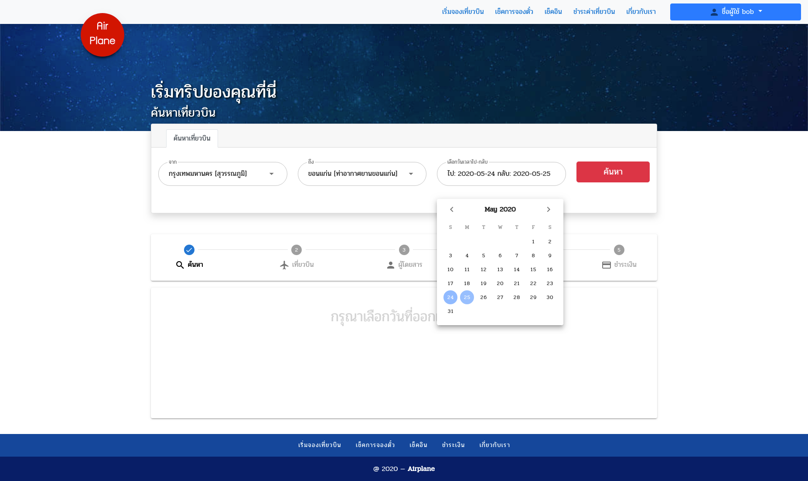
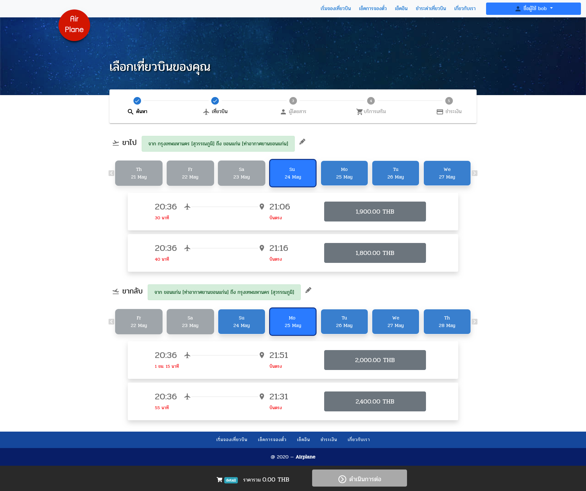
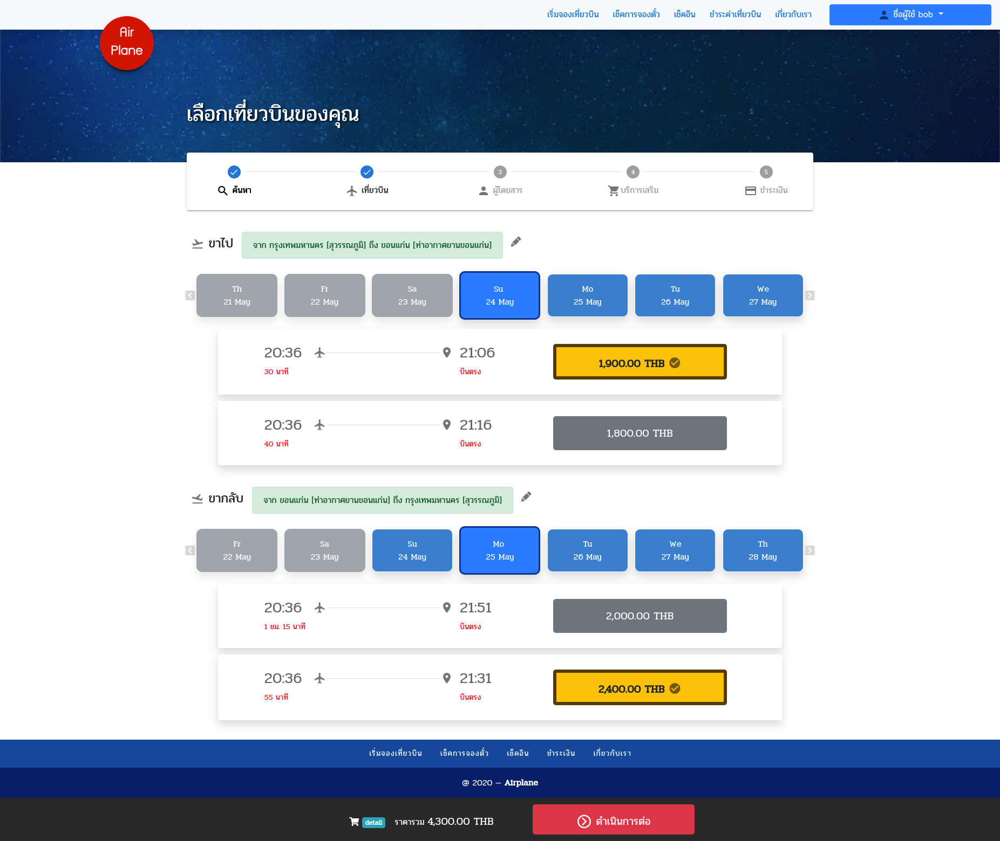
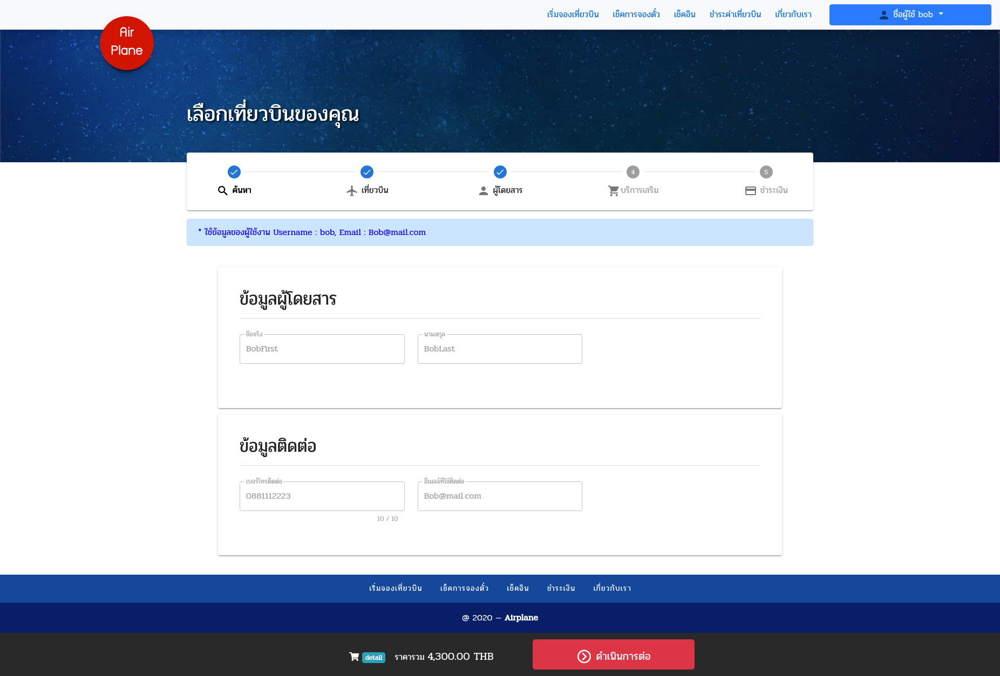
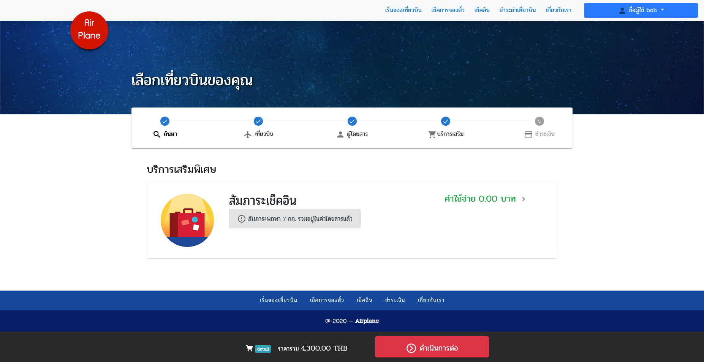
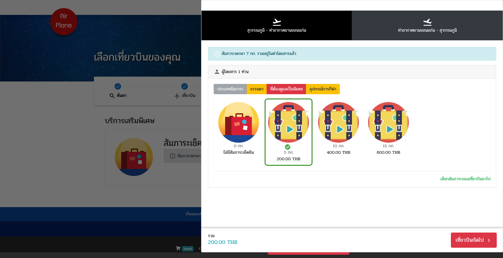
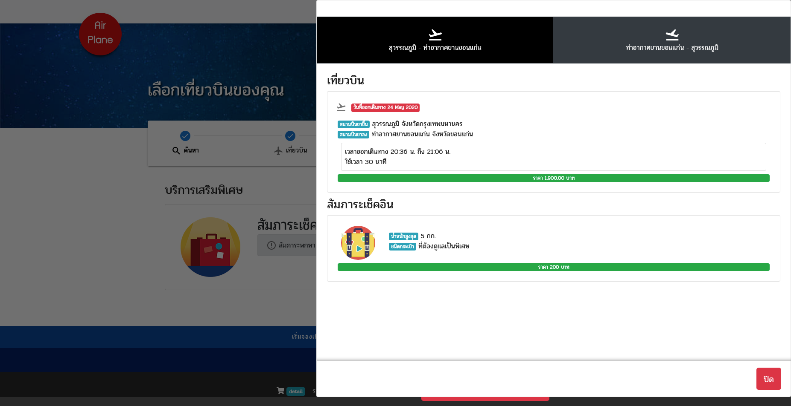
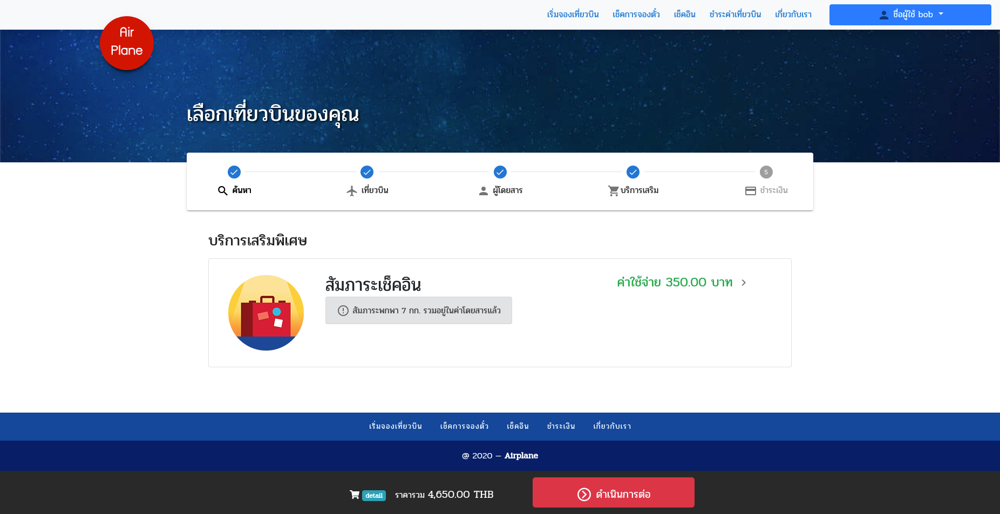

# team24
## สมาชิกทีม
* B6000035 นางสาวอริสา รังกลาง
* B6000530 นายกันตพงศ์ พูนเกษม
* B6005818 นายชยากร พิลึกนา
* B6012540 นายเปี่ยมพูล พูลเปี่ยม
* B6016357 นายไตรรงค์ บำรุงเกตุอุดม
* B6026066 นายคณิศร ศรีแสงทรัพย์

# ระบบจองเที่ยวบิน

## ระบบย่อยที่มีสำหรับลูกค้า (Customer) สายการบิน

~~~~
* Sprint 1
    - ระบบค้นหาและจองเที่ยวบิน
    - ระบบเช็คอิน
    - ระบบชำระเงิน
    
* Sprint 2
    - ระบบจองบริการเสริมพิเศษ
    - ระบบออกบิลชำระเงิน
    - ระบบตรวจสอบการจองตั๋วเครื่องบิน
~~~~

## ระบบย่อยที่มีสำหรับพนักงาน (Admin)
~~~~
* Sprint 1
    - ระบบเพิ่มลดเที่ยวบิน
    - ระบบจัดการบริการเสริมพิเศษ
    - ระบบเพิ่มลดโปรโมชั่น

* Sprint 2
    - ระบบตรวจสอบการชำระเงิน
    - ระบบตรวจสอบการเช็คอิน
~~~~

# SCREENSHOT

 ## Book Flights
   - หน้าค้นหาเที่ยวบิน สามารถเลือกสนามบินขาไปและกลับได้ รวมถึงเลือกวันเดินทางขาไปและกลับ 
     
   - หน้าแสดงรายการเที่ยวบิน ตามวันที่เดินทางขาไปและกลับ
     
   - เลือกเที่ยวบินที่คุณต้องการ
     
   - หน้าแสดงข้อมูลผู้โดยสาร (บัญชีที่เข้าสู่ระบบ)
     
   - หน้าเลือกน้ำหนักสัมภาระ สามารถเลือกสัมภาระขาไปและกลับได้ มีการแยกประเภทชัดเจน
     
     
   - สามารถดูรายละเอียดการสั่งซื้อได้โดยกดปุ่ม detail ด้านล่างตรงแทบแสดงราคารวม
    
    - หลังจากเลือกสัมภาระขาไปและกลับแล้ว เมื่อกดดำเนินการต่อ ระบบจะพาท่านไปที่หน้าชำระเงินทันที
    
  
 
 ## Payments
  - หน้าชำระเงิน จะแสดงหลังจากทำการเลือกเที่ยวบิน และสัมภาระสำเร็จ
  
